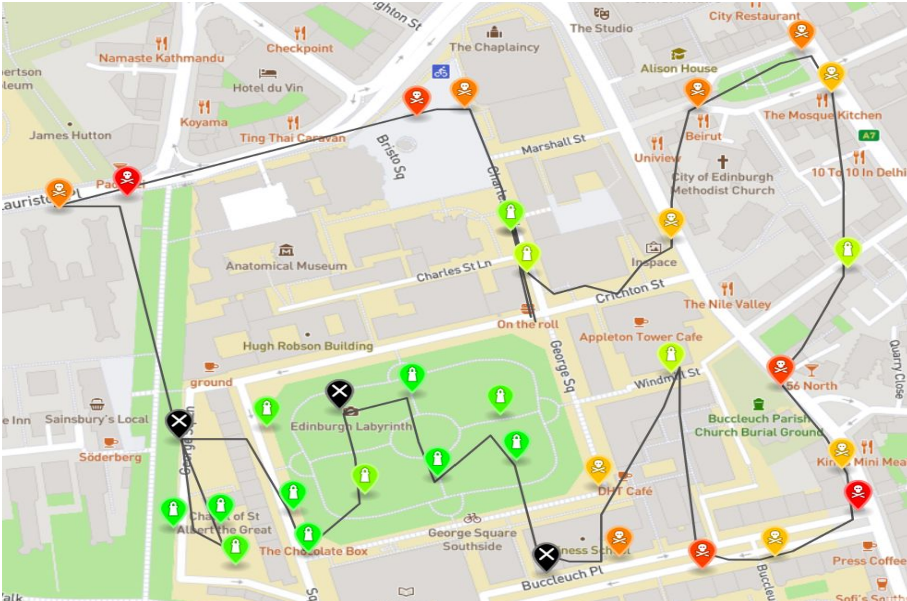
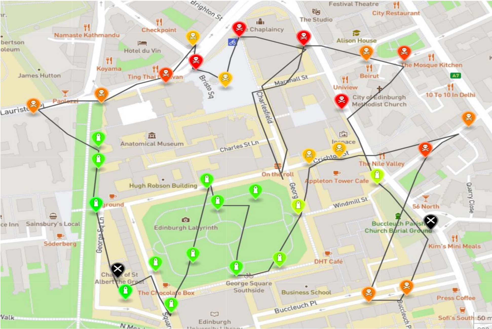

# Air Pollution Visualizer

This repository contains the software for a drone to collect and visualize pollution data from sensors. While it's not connected to any Drone API, it implements the logic of travelling a defined location, collects sensor data from a nearby web server, and returns to its original position.

This project was the second coursework for the 3rd year honours course [Informatics Large Practical](http://www.drps.ed.ac.uk/20-21/dpt/cxinfr09051.htm) taught at the University of Edinburgh.

Course Grade: 4.0/4.0 - Top 10% of a class of 200.

## Demos

Pollution data visualized in [GeoJSON](https://en.wikipedia.org/wiki/GeoJSON) format.

**Location**: Central Edinburgh - *05/20/2020 & 05/20/2021*

## License:
[MIT](https://github.com/GaganSD/Air-Pollution-Visualizer) © Gagan Devagiri
